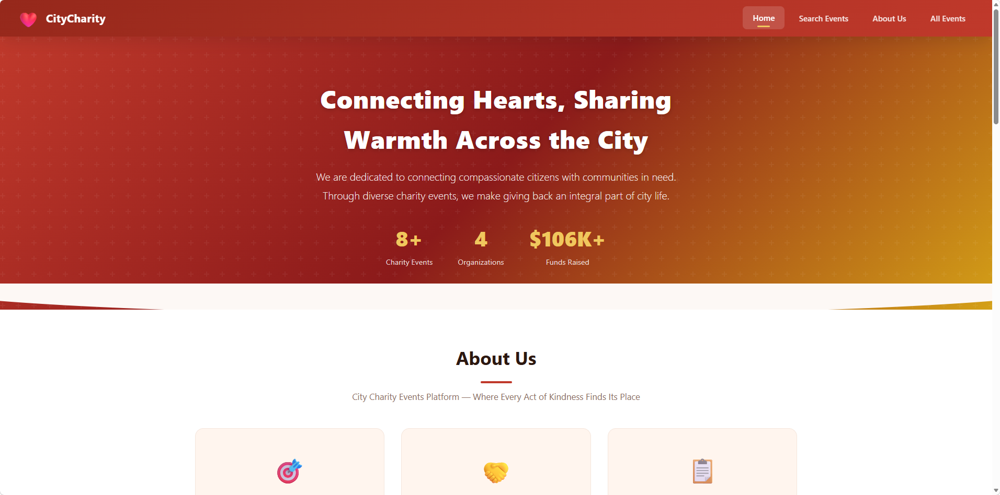
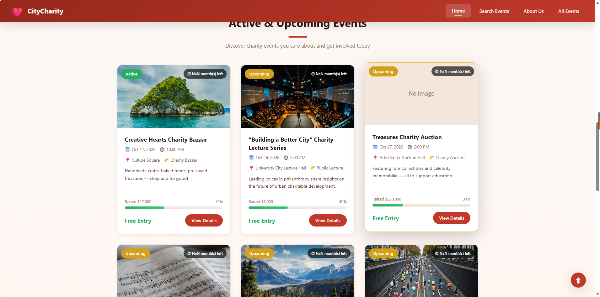
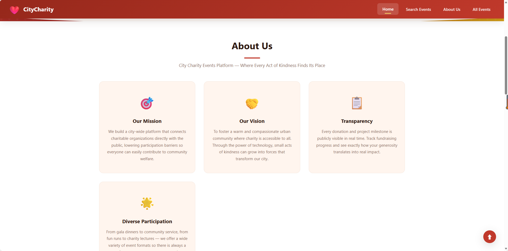
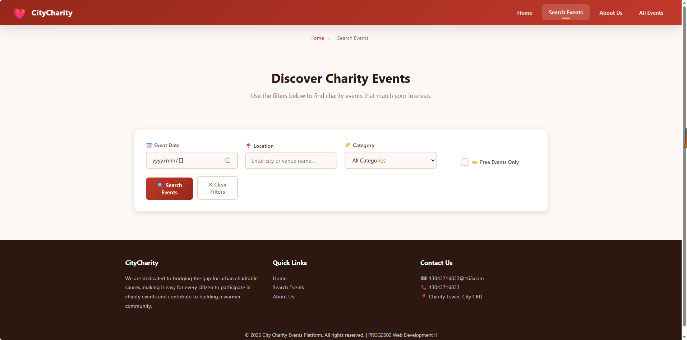
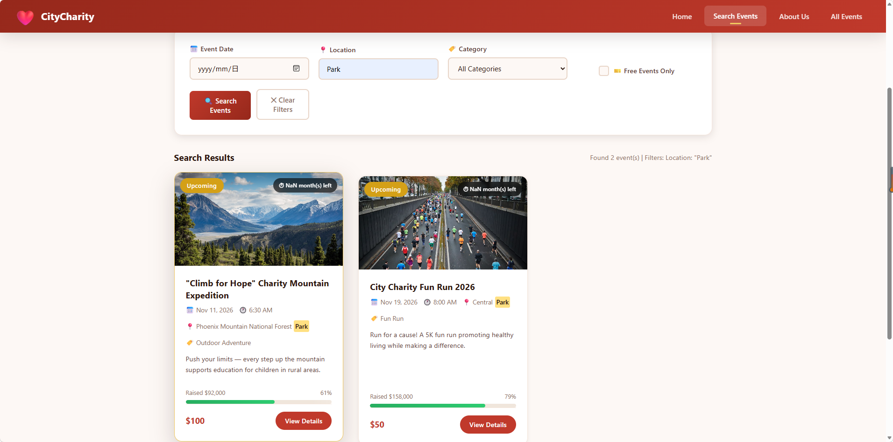
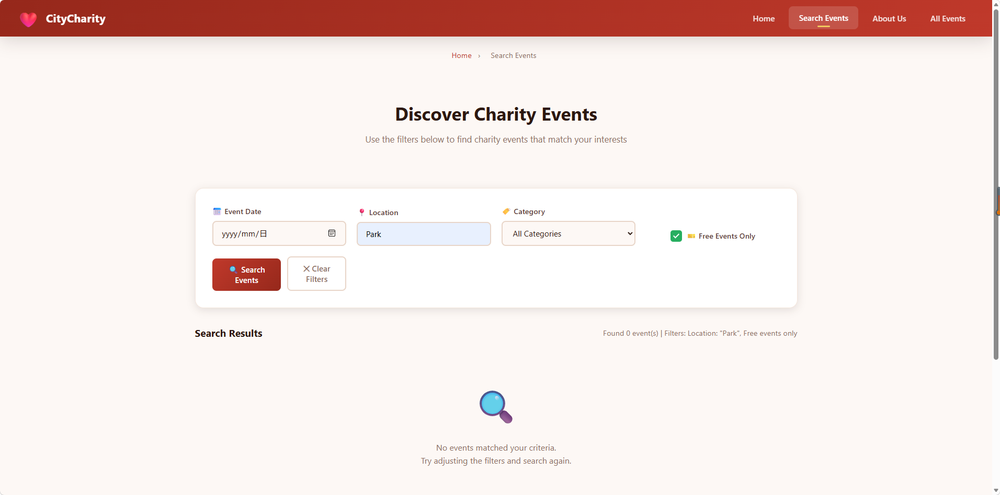
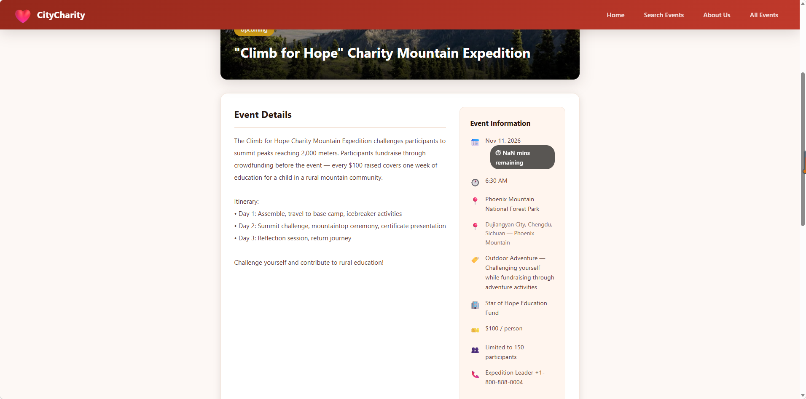
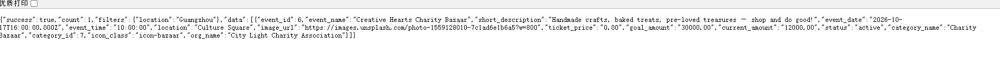
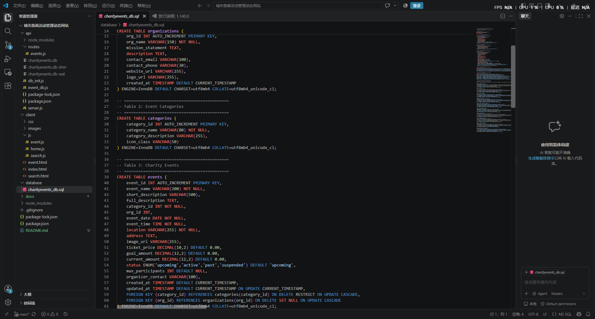

# City Charity Events Management Dynamic Website

**A full-stack, data-driven charity event platform — MySQL · Node.js/Express · Vanilla JavaScript**

[](https://nodejs.org/)
[](https://expressjs.com/)
[](https://www.mysql.com/)
[](https://restfulapi.net/)
[]()

---

## Table of Contents

- [1. Project Overview](#1-project-overview)
- [2. Innovation Highlights](#2-innovation-highlights)
- [3. Competitive Advantages](#3-competitive-advantages)
- [4. Technical Challenges & Solutions](#4-technical-challenges--solutions)
- [5. Technology Stack](#5-technology-stack)
- [6. System Architecture](#6-system-architecture)
- [7. Database Design](#7-database-design)
- [8. API Reference](#8-api-reference)
- [9. Project Structure](#9-project-structure)
- [10. Getting Started](#10-getting-started)
- [11. Demo Screenshots](#11-demo-screenshots)
- [12. Engineering Skills Demonstrated](#12-engineering-skills-demonstrated)
- [13. Future Work — Extensibility toward AI/ML](#13-future-work--extensibility-toward-aiml)

---
---

# PART I — ENGLISH

---

## 1. Project Overview

The **City Charity Events Management Dynamic Website** is a three-tier dynamic web application that connects charitable organizations with the public. It allows citizens to discover, filter, and inspect charity events — galas, fun runs, auctions, concerts, volunteer drives, and more — through a data-driven interface backed by a relational database and a RESTful API.

The system is deliberately built **without any frontend framework**. Every request, response, state transition, and DOM mutation is written explicitly in vanilla JavaScript. This was a conscious engineering decision: it forces full control over the HTTP lifecycle and DOM, and demonstrates a first-principles understanding of how the web actually works — a foundation that transfers directly to backend, data-engineering, and ML-serving work.

**Core capabilities delivered:**

| Capability | Description |
|---|---|
| Dynamic home page | Server-filtered list of ongoing/upcoming events, rendered from live API data |
| Multi-criteria search | Combinable filtering by **date**, **location** (fuzzy), and **category**, plus a free-events toggle |
| Event detail page | Full description, ticket info, organizer profile, and live fundraising progress |
| Content lifecycle | `past` / `suspended` events are automatically withheld from public listings |
| Graceful states | Loading spinners, empty states, and error handling across every data-dependent view |
| Responsive UI | Mobile navigation, fluid grid layouts, and reveal-on-scroll animations |

---

## 2. Innovation Highlights

### 2.1 Status-Driven Content Lifecycle (Business Logic in the Data Layer)

Rather than hard-coding which events to show, the platform encodes the business rule directly into the data model. The `events.status` column is an `ENUM('upcoming','active','past','suspended')`, and every public listing query enforces `WHERE status IN ('upcoming','active')`.

This means **event visibility is a single source of truth in the database**, not scattered across application code. A suspended event disappears from the home page and search results simultaneously, with zero code changes — the lifecycle is data, not logic.

```sql
-- database/charityevents_db.sql
status ENUM('upcoming','active','past','suspended') DEFAULT 'upcoming',
```

### 2.2 Composable, Injection-Safe Dynamic Query Builder

The search endpoint is the technical centerpiece. Instead of writing four separate queries for four filters, it **builds one SQL statement conditionally at runtime** while keeping every user value in a bound parameter array:

```js
// api/routes/events.js — lines 91–118
const params = [];

if (date)     { sql += ' AND e.event_date = ?';            params.push(date); }
if (location) { sql += ' AND (e.location LIKE ? OR e.address LIKE ?)';
                params.push(`%${location}%`, `%${location}%`); }
if (category) { sql += ' AND c.category_id = ?';           params.push(parseInt(category)); }
if (freeOnly === '1') { sql += ' AND (e.ticket_price = 0 OR e.ticket_price IS NULL)'; }

const [rows] = await pool.execute(sql, params);   // parameterised — SQL-injection safe
```

The design achieves three things at once: **arbitrary filter combinations** (1 to 4 criteria) with no combinatorial explosion of query variants, **prepared-statement execution** that structurally prevents SQL injection, and a **single normalized result shape** for the frontend.

### 2.3 Single-Origin Architecture (CORS Elimination by Design)

Express serves both the API and the static client from the same origin:

```js
// api/server.js — line 32
app.use(express.static(path.join(__dirname, '..', 'client')));
```

Because the client and API share an origin, production cross-origin requests cannot occur, and the frontend needs no hard-coded backend URL — it derives it at runtime via `window.location.origin`. This is a deployment-simplicity decision that also removes an entire class of CORS-related failure modes.

### 2.4 Framework-Free Rendering Pipeline

The frontend implements a **pure-function render pipeline**: data objects in, HTML strings out, single DOM write.

```js
// client/js/home.js — lines 166–167
const cardsHTML = result.data.map(event => renderEventCard(event)).join('');
container.innerHTML = `<div class="events-grid">${cardsHTML}</div>`;
```

`renderEventCard()` is a pure function of one event object — trivially testable, free of side effects, and reusable across the home and search pages. The array is mapped and joined into a **single string**, then committed to the DOM **once**, avoiding the layout thrashing of incremental insertion (the N-reflow problem).

### 2.5 Timezone-Safe Date Handling (Debugged from a UI Symptom)

This is the most instructive bug in the project, because it was **found from a user-visible symptom rather than a failing test**. The home page rendered every event date one day early, and every countdown badge read `NaN month(s) left`. Both symptoms had one root cause, and fixing it required tracing a single value across all three tiers.

**Root cause.** MySQL `DATE` columns were returned by the `mysql2` driver as JavaScript `Date` objects. When `res.json()` serialised them, a stored date of `2026-10-18` became `"2026-10-17T16:00:00.000Z"` — an **instant**, not a calendar date. The client then read the *UTC* day out of that string, which sits one day behind the local date:

| Layer | Value |
|---|---|
| MySQL `DATE` column | `2026-10-18` |
| After `mysql2` → JS `Date` | local midnight, 18 Oct (UTC+8) |
| After `JSON.stringify` | `2026-10-17T16:00:00.000Z` |
| Client `split('-')[2]` | `17` → **renders "Oct 17"** ✗ |

The countdown failed harder still: `new Date(dateStr + 'T00:00:00')` produced an **Invalid Date** from the concatenated string, and `Math.ceil(NaN / 30)` surfaced to the user as `NaN month(s) left`.

**The fix is applied at two layers — defence in depth:**

```js
// api/event_db.js — stop the driver inventing a time component
const pool = mysql.createPool({ /* ... */ dateStrings: true });
```

```js
// client/js/home.js — tolerate either representation, never crash
const parts = String(dateStr).substring(0, 10).split('-');
```

The backend now emits a plain `2026-10-18`, and the frontend slices to the first ten characters so it still renders correctly if a full timestamp ever arrives. The countdown additionally guards with `isNaN(eventDate.getTime())`.

**Why this matters:** the defect was invisible in the API's own output — the JSON was syntactically valid and passed every `typeof` check. It only appeared at render time, and diagnosing it required reasoning about driver type coercion, timezone conversion, and JSON serialisation simultaneously. That is the class of bug that separates "the code runs" from "the software is correct".

### 2.6 Multi-Layer Validation Strategy

Data integrity is validated at **four independent layers**, so no single point of failure can admit bad data:

| Layer | Mechanism |
|---|---|
| Database | `ENUM` constraints, `NOT NULL`, foreign keys, referential actions |
| API — parameter | `isNaN(eventId)` → HTTP **400** for malformed IDs |
| API — existence | Empty result set → HTTP **404** with a JSON error body |
| Client | `response.ok` check **and** business-level `result.success` check |

### 2.7 Referential Integrity with Intentional Cascade Semantics

Foreign keys are not merely present — their **delete behaviour encodes business policy**:

- `category_id → categories` uses `ON DELETE RESTRICT`: a category that still has events **cannot** be destroyed, protecting historical records.
- `org_id → organizations` uses `ON DELETE SET NULL`: an organization may leave, but its events **survive** as unassigned records rather than vanishing.

---

## 3. Competitive Advantages

| # | Advantage | Why it matters |
|---|---|---|
| 1 | **No framework dependency** | Zero frontend build step, zero npm attack surface, instant load, and demonstrable mastery of core web APIs over framework familiarity |
| 2 | **Connection pooling** | `mysql2` pool (limit 10, keep-alive) reuses sockets instead of opening one connection per request — the difference between a toy and a load-tolerant service |
| 3 | **N+1 query elimination** | Home, search, and detail endpoints each fetch denormalized data via `JOIN`s in **one round-trip** instead of N follow-up queries |
| 4 | **Indexed hot paths** | Indexes on `status`, `event_date`, and `category_id` — exactly the columns the filters and sort order touch |
| 5 | **Uniform API contract** | Every response shares the `{ success, count, data, ... }` envelope, making client handling predictable and uniform |
| 6 | **Dual persistence path** | MySQL is the production database; an auxiliary `better-sqlite3` bootstrap (`db_init.js`) lets the project run with **zero external services** for demo purposes |
| 7 | **Progressive UX states** | Loading, empty, error, and success render paths are all handled — the app never shows a blank screen or raw stack trace |
| 8 | **Database-agnostic seed strategy** | Seeds are idempotent and transactional (`db.transaction()`), so a fresh database is one command away |

---

## 4. Technical Challenges & Solutions

### Challenge 1 — Preventing SQL Injection in a Dynamically Built Query
**Problem:** Building a search string by concatenating user input is the classic injection vector; but static queries cannot express optional filters.
**Solution:** Assemble only the *SQL fragments* conditionally, and route every *user value* through a `params` array executed by `pool.execute()`. Prepared statements separate code from data, so injection is structurally impossible.

### Challenge 2 — Avoiding the N+1 Query Problem
**Problem:** Returning events *with* their category and organization invites three separate queries per event — O(N) round-trips.
**Solution:** A single query with `INNER JOIN categories` and `LEFT JOIN organizations`. The `LEFT` join on organizations is deliberate: events without a sponsor must still appear, which an inner join would silently drop.

### Challenge 3 — Passing State Between Pages Without a Framework
**Problem:** No client-side router, no global store — yet the detail page must know *which* event to fetch.
**Solution:** The event ID is threaded through the URL as a query string (`event.html?id=7`) and read back with `URLSearchParams`. This makes every detail view **deep-linkable, shareable, and refresh-safe** — arguably better than transient in-memory state.

### Challenge 4 — Diagnosing a Cross-Tier Timezone Bug from a UI Symptom
**Problem:** Every event rendered one day early and every countdown badge showed `NaN month(s) left` — yet there was no console error and the API response was syntactically valid JSON.
**Solution:** Traced the value across all three tiers and found that `mysql2` was converting MySQL `DATE` into a JS `Date` at local midnight, which serialised as a UTC timestamp one day behind (`2026-10-17T16:00:00.000Z`). Fixed at the source with `dateStrings: true` in the pool configuration, plus defensive date normalisation on the client so the UI degrades gracefully instead of printing `NaN`. See [§2.5](#25-timezone-safe-date-handling-debugged-from-a-ui-symptom).

### Challenge 5 — Rendering Many Cards Without Layout Thrashing
**Problem:** Appending cards one-by-one causes repeated reflow and visible jank.
**Solution:** Build the full HTML string in memory, then commit it in one `innerHTML` assignment; animate progress bars afterwards on the next animation frame via `requestAnimationFrame`.

### Challenge 6 — Coordinating 404/400/500 Semantics Across the Stack
**Problem:** Distinguishing "malformed request" from "not found" from "server fault" — and surfacing each correctly to the user.
**Solution:** The API returns `400` for non-numeric IDs, `404` for missing records, and `500` for database faults, each with a JSON body. The client inspects `response.status` first and the business `success` flag second.

### Challenge 7 — Foreign-Key Delete Semantics That Match Business Reality
**Problem:** A blanket `CASCADE` would delete historical events when an organization is removed — data loss with real business impact.
**Solution:** Deliberate per-relationship actions: `RESTRICT` to protect categories in use, `SET NULL` to preserve events when an organization departs.

---

## 5. Technology Stack

### Backend
| Technology | Version | Role |
|---|---|---|
| Node.js | ≥ 18 | Runtime environment |
| Express | ^4.18 | HTTP server, routing, middleware, static hosting |
| mysql2 | ^3.6 | MySQL driver with Promise API and connection pooling |
| better-sqlite3 | ^13.0 | Zero-config SQLite bootstrap for local demos |
| cors | ^2.8 | Cross-origin middleware (defensive, for split-origin deployment) |
| dotenv | ^16.3 | Environment-based configuration |
| nodemon | ^3.0 | Dev-time auto-restart |

### Database
| Technology | Role |
|---|---|
| MySQL 8.x | Primary relational store — InnoDB, `utf8mb4`, foreign keys, ENUM, indexes |
| SQLite | Portable single-file store used by the seed script |

### Frontend
| Technology | Role |
|---|---|
| HTML5 | Semantic page structure, three pages |
| CSS3 | Custom design system — CSS variables, Flexbox, Grid, keyframe animations, media queries |
| Vanilla JavaScript (ES6+) | `fetch`, `async/await`, `Promise`, DOM API, `URLSearchParams`, `IntersectionObserver`, `IntersectionObserver`-based reveal animations |

> **Notably absent:** no React/Vue/Angular, no jQuery, no CSS framework, no bundler. Every abstraction is hand-implemented.

### Codebase Scale
| Layer | Files | Lines |
|---|---|---|
| Backend (JS) | 4 | ~553 |
| Frontend (JS) | 3 | ~831 |
| Stylesheet (CSS) | 1 | ~943 |
| Markup (HTML) | 3 | ~442 |
| Schema (SQL) | 1 | ~151 |
| **Total** | **12** | **≈ 2,900** |

---

## 6. System Architecture

```
┌─────────────────────────────────────────────────────────────────┐
│                          BROWSER (Client)                        │
│   index.html      search.html      event.html                    │
│   home.js         search.js        event.js                      │
│        │              │                │                         │
│        └──────────────┴────────────────┘                         │
│                       │  fetch() + async/await                   │
└───────────────────────┼──────────────────────────────────────────┘
                        │  HTTP / JSON
┌───────────────────────▼──────────────────────────────────────────┐
│                    EXPRESS SERVER  (api/server.js)               │
│   cors() · express.json() · express.static('../client')          │
│                       │                                          │
│              ┌────────▼─────────┐                                │
│              │  routes/events.js │  4 REST endpoints             │
│              └────────┬─────────┘                                │
└───────────────────────┼──────────────────────────────────────────┘
                        │  pool.execute(sql, params)
┌───────────────────────▼──────────────────────────────────────────┐
│                 MYSQL  ·  charityevents_db                       │
│      organizations ──┐                                           │
│                      ├── events ──> categories                   │
│      (foreign keys, ENUM status, indexes)                        │
└──────────────────────────────────────────────────────────────────┘
```

**Request lifecycle (search example):**
1. User submits the filter form → `searchEvents()` intercepts with `preventDefault()`
2. `URLSearchParams` builds the query string from only the populated fields
3. `fetch()` issues `GET /api/events/search?...`
4. Express routes to `router.get('/search')` → dynamic SQL + bound params
5. MySQL executes the prepared statement against indexed columns
6. JSON `{ success, count, filters, data }` returns to the browser
7. `map(renderEventCard).join()` builds the HTML; one `innerHTML` write renders all cards
8. `requestAnimationFrame` animates the progress bars; `IntersectionObserver` reveals cards on scroll

---

## 7. Database Design

Three normalized tables in **Third Normal Form**, with `events` as the central fact table.

```
┌────────────────────┐          ┌─────────────────────┐
│   organizations    │          │     categories      │
├────────────────────┤          ├─────────────────────┤
│ org_id        PK   │          │ category_id    PK   │
│ org_name           │          │ category_name       │
│ mission_statement  │          │ category_description│
│ description        │          │ icon_class          │
│ contact_email      │          └──────────┬──────────┘
│ contact_phone      │                     │
│ website_url        │                     │
│ logo_url           │                     │
│ created_at         │                     │
└─────────┬──────────┘                     │
          │                                │
          │  ON DELETE SET NULL            │  ON DELETE RESTRICT
          │                                │
     ┌────▼────────────────────────────────▼─────┐
     │                  events                    │
     ├────────────────────────────────────────────┤
     │ event_id          PK                       │
     │ event_name · short_description             │
     │ full_description                           │
     │ category_id       FK → categories          │
     │ org_id            FK → organizations       │
     │ event_date · event_time                    │
     │ location · address · image_url             │
     │ ticket_price · goal_amount · current_amount│
     │ status  ENUM(upcoming|active|past|suspended)│
     │ max_participants · organizer_contact       │
     │ created_at · updated_at                    │
     │                                            │
     │ INDEX (status) (event_date) (category_id)  │
     └────────────────────────────────────────────┘
```

**Design rationale**

| Decision | Justification |
|---|---|
| 3NF normalization | Eliminates update anomalies — an organization's contact details live in exactly one row |
| `ENUM` for `status` | Enforces the lifecycle vocabulary at the database level; invalid states are unrepresentable |
| `DECIMAL(12,2)` for money | Exact decimal arithmetic — floating point would introduce rounding errors in financial totals |
| Indexes on `status`, `event_date`, `category_id` | These are precisely the columns used by the `WHERE` filters and `ORDER BY` sort |
| `updated_at ... ON UPDATE CURRENT_TIMESTAMP` | Audit trail with no application-level bookkeeping |
| `utf8mb4` charset | Full Unicode including emoji and CJK text |
| Separate `organizations` table | Prevents duplicated sponsor data across many events (a 3NF violation) |

**Seed dataset:** 10 events across 8 categories and 4 organizations — including one `past` and one `suspended` event, deliberately seeded to prove the visibility filter works.

---

## 8. API Reference

Base URL: `http://localhost:3000`

| # | Method | Endpoint | Purpose | Feeds |
|---|---|---|---|---|
| 1 | `GET` | `/api` | Service discovery / health check | — |
| 2 | `GET` | `/api/events` | Ongoing + upcoming events with category & organization | Home page |
| 3 | `GET` | `/api/events/search` | Multi-criteria filtered search | Search page |
| 4 | `GET` | `/api/events/categories/list` | All categories with per-category event counts | Search dropdown |
| 5 | `GET` | `/api/events/:id` | Full detail for one event + computed progress % | Detail page |

### `GET /api/events`
Returns every `upcoming` or `active` event, ordered chronologically.
```json
{ "success": true, "count": 8,
  "data": [ { "event_id": 3, "event_name": "Treasures Charity Auction",
              "category_name": "Charity Auction", "org_name": "Love Foundation",
              "event_date": "2026-10-28", "status": "upcoming" } ] }
```

### `GET /api/events/search`
| Query param | Type | Behaviour |
|---|---|---|
| `date` | `YYYY-MM-DD` | Exact date match |
| `location` | string | **Fuzzy** — `LIKE %…%` against both `location` and `address` |
| `category` | int | Exact category ID match |
| `freeOnly` | `1` | Only events where `ticket_price = 0` or `NULL` |

All parameters are **optional and freely combinable**; omitted filters are simply not added to the `WHERE` clause.

```
GET /api/events/search?location=Guangzhou&freeOnly=1
```

### `GET /api/events/:id`
Returns the event plus joined category/organization data and a **server-computed** `progress_percentage`.
- `400` — id is not numeric
- `404` — no such event

### Error contract
Every failure returns a consistent envelope:
```json
{ "success": false, "message": "Event not found" }
```

---

## 9. Project Structure

```
城市慈善活动管理动态网站/
├── api/                          # Backend — Express RESTful API
│   ├── server.js                 # Entry point: middleware, routing, static hosting
│   ├── event_db.js               # MySQL connection pool + health check
│   ├── db_init.js                # SQLite bootstrap: schema + transactional seeding
│   ├── routes/
│   │   └── events.js             # 4 REST endpoints, dynamic SQL builder
│   ├── package.json
│   └── package-lock.json
│
├── client/                       # Frontend — framework-free
│   ├── index.html                # Home: hero, about, dynamic event grid
│   ├── search.html               # Search: multi-criteria filter form + results
│   ├── event.html                # Detail: full info, progress, register modal
│   ├── css/
│   │   └── style.css             # Design system: variables, Grid, Flexbox, animations
│   ├── js/
│   │   ├── home.js               # Fetch lifecycle + card renderer + hero stats
│   │   ├── search.js             # Query builder, highlighting, clear filters
│   │   └── event.js              # URL param parsing + detail renderer
│   └── images/
│
├── database/
│   └── charityevents_db.sql      # MySQL schema + seed data (import this)
│
├── docs/
│   └── screenshots/              # Demo screenshots referenced in §11
├── package.json
└── README.md
```

---

## 10. Getting Started

### Prerequisites
- Node.js ≥ 18
- MySQL 8.x running locally

### 1 · Create the database
```bash
mysql -u root -p < database/charityevents_db.sql
```
This creates `charityevents_db`, the three tables, and seeds 10 events / 8 categories / 4 organizations.

### 2 · Configure the connection
Edit `api/event_db.js` to match your local credentials:
```js
const pool = mysql.createPool({
  host: 'localhost', port: 3306,
  user: 'root', password: '',
  database: 'charityevents_db', charset: 'utf8mb4',
  connectionLimit: 10
});
```

### 3 · Install & run
```bash
cd api
npm install
node server.js
```
Expected startup output:
```
MySQL database connected successfully!
  Events: 10 | Categories: 8
  Server:     http://localhost:3000
  Website:    http://localhost:3000/
  API:        http://localhost:3000/api
```

### 4 · Open the site
| Page | URL |
|---|---|
| Home | http://localhost:3000/ |
| Search | http://localhost:3000/search.html |
| Detail | http://localhost:3000/event.html?id=1 |
| API root | http://localhost:3000/api |

### Optional — MySQL-free demo
```bash
cd api && node db_init.js   # builds a standalone SQLite database
```

---

## 11. Demo Screenshots

Every image below is a live capture of the running application against the MySQL `charityevents_db` database.

### 11.1 Home page

| Hero section & live statistics | Dynamic event grid |
|---|---|
|  |  |

The hero figures (`8+ Charity Events`, `4 Organizations`, `$106K+ Funds Raised`) are **computed from the API response**, not hard-coded. Each card carries a status badge, a live countdown, and a fundraising progress bar, and the grid is populated entirely by `GET /api/events`.



The static About Us section, rendered from hard-coded HTML.

### 11.2 Search page — multi-criteria filtering

| Filter form | Results with keyword highlighting |
|---|---|
|  |  |



Four independent filter controls (date, location, category, free-only) combine freely; the result header reports the count and echoes the applied filters. Matched location text is highlighted in-place via `<mark>`.

### 11.3 Event detail page

| Full event record | Register modal |
|---|---|
|  |  |

### 11.4 Backend

| API response (Postman) | Database schema |
|---|---|
|  |  |

> **Screenshot conventions:** files live in `docs/screenshots/`, filenames are lower-case and hyphenated (never spaced, since spaces break Markdown image paths), and home-page views are suffixed `01a` / `01b` / `01c` so the reading order matches the page scroll order.

---

## 12. Engineering Skills Demonstrated

This project maps directly onto competencies expected in **Software Engineering** and **AI/ML** graduate study:

| Competency | Evidence in this project |
|---|---|
| Relational data modelling | 3NF schema, primary/foreign keys, referential actions, ENUM domains, indexing |
| SQL proficiency | Multi-table `JOIN`s, aggregate `COUNT` with `LEFT JOIN`, dynamic `WHERE` construction, `ORDER BY` |
| Backend / API engineering | Express middleware pipeline, RESTful resource design, correct HTTP status semantics, uniform response contracts |
| Security awareness | Prepared statements (SQL-injection prevention), parameter validation, error-message hygiene |
| Asynchronous programming | `async/await`, `Promise` chains, `fetch`, non-blocking I/O |
| Frontend / DOM engineering | Framework-free rendering, single-write DOM updates, `IntersectionObserver`, responsive CSS, animations |
| Software architecture | Layered separation (presentation / routing / persistence), single-origin deployment, configuration externalization |
| Data pipeline thinking | Data flows from normalized storage → SQL transformation → JSON serialization → DOM rendering, with validation at each boundary |
| Debugging & correctness | Timezone off-by-one diagnosis, N+1 elimination, empty/error-state coverage |

The **data pipeline thinking** in the final row is the most portable skill: the ability to trace and validate a record's journey from storage, through transformation, to consumer is precisely the discipline required to build, serve, and monitor machine-learning pipelines.

---

## 13. Future Work — Extensibility toward AI/ML

The current system is a complete, conventional dynamic website. Its architecture, however, is a deliberate **foundation for AI/ML extension**, because every layer already exposes exactly the interfaces an intelligent feature would need.

| Direction | How the existing architecture enables it |
|---|---|
| **Semantic search** | The `full_description` TEXT column is already a natural corpus for embeddings; replace the `LIKE` filter with vector similarity while keeping the same API contract |
| **Recommendation engine** | `events`, `categories`, and `organizations` provide the entities; adding a `registrations` table yields the user–item interaction matrix that collaborative filtering requires |
| **Predictive fundraising** | `goal_amount` / `current_amount` time series across events is already structured data — a natural fit for regression or time-series forecasting |
| **NLP query parsing** | Natural-language queries ("free concerts in Guangzhou next month") could be parsed into the existing `{date, location, category, freeOnly}` parameter set — the API already accepts exactly that structured form |
| **Automated content moderation** | Policy-violating events are currently flagged manually via `status = 'suspended'`; text/image classifiers could automate that decision and write to the same column |
| **Event image understanding** | `image_url` fields across events form a ready image dataset for classification or auto-tagging |

**The key architectural insight:** the API layer is already the correct place to inject intelligence. A model-backed service can sit behind `/api/events/search` or a new `/api/recommendations` endpoint without changing a single line of frontend code — because the frontend depends only on the **JSON contract**, not on how the answer was produced. That clean separation is what makes this project a credible base for AI-augmented development.

---
---

# 第二部分 — 中文版

---

## 1. 项目概述

**城市慈善活动管理动态网站** 是一个三层架构的动态 Web 应用，连接慈善组织与公众用户。市民可以通过数据驱动的界面浏览、筛选和查看各类慈善活动 —— 包括慈善晚宴、趣味跑、拍卖会、音乐会、志愿服务等。整个系统由关系型数据库与 RESTful API 支撑。

本项目**刻意不使用任何前端框架**。每一次请求、响应、状态流转与 DOM 更新都用原生 JavaScript 显式编写。这是一个经过深思的工程决策：它迫使开发者完全掌控 HTTP 生命周期与 DOM，展现对 Web 运行原理的第一性理解 —— 而这种基础能力可以直接迁移到后端、数据工程以及 ML 服务化等方向。

**已实现的核心能力：**

| 能力 | 说明 |
|---|---|
| 动态首页 | 由 API 实时数据渲染的进行中/即将举行活动列表 |
| 多条件搜索 | **日期**、**地点**（模糊匹配）、**类别** 可自由组合筛选，并支持"仅免费活动"开关 |
| 活动详情页 | 完整描述、票务信息、主办方档案、实时筹款进度 |
| 内容生命周期 | `past` / `suspended` 状态的活动自动从公开列表中隐藏 |
| 优雅状态处理 | 所有依赖数据的视图均具备加载中、空结果、错误三种状态 |
| 响应式界面 | 移动端导航、流式网格布局、滚动渐显动画 |

---

## 2. 创新点

### 2.1 状态驱动的内容生命周期（业务逻辑下沉到数据层）

本平台不通过硬编码决定展示哪些活动，而是把业务规则直接编码进数据模型。`events.status` 字段类型为 `ENUM('upcoming','active','past','suspended')`，所有公开列表查询统一强制 `WHERE status IN ('upcoming','active')`。

这意味着**活动可见性是数据库中的唯一事实来源**，而不是散落在应用代码各处。一个被暂停的活动会同时从首页和搜索结果中消失，无需改动任何代码 —— 生命周期是数据，而不是逻辑。

### 2.2 可组合且防注入的动态查询构建器

搜索接口是本项目的技术核心。它没有为四种筛选条件写四条独立查询，而是**在运行时按条件拼装单条 SQL**，同时把所有用户输入保存在绑定参数数组中：

```js
// api/routes/events.js — 91–118 行
const params = [];

if (date)     { sql += ' AND e.event_date = ?';       params.push(date); }
if (location) { sql += ' AND (e.location LIKE ? OR e.address LIKE ?)';
                params.push(`%${location}%`, `%${location}%`); }
if (category) { sql += ' AND c.category_id = ?';      params.push(parseInt(category)); }
if (freeOnly === '1') { sql += ' AND (e.ticket_price = 0 OR e.ticket_price IS NULL)'; }

const [rows] = await pool.execute(sql, params);   // 预编译 —— 防 SQL 注入
```

该设计同时达成三件事：**任意条件组合**（1 到 4 个条件）而无需穷举查询变体、通过**预编译语句**在结构上杜绝 SQL 注入、为前端提供**统一的返回结构**。

### 2.3 同源架构（从设计上消除 CORS 问题）

Express 同时托管 API 与静态前端，二者同源：

```js
// api/server.js — 32 行
app.use(express.static(path.join(__dirname, '..', 'client')));
```

由于客户端与 API 共享同源，生产环境中不可能出现跨域请求，前端也无需硬编码后端地址 —— 通过 `window.location.origin` 在运行时自动获取。这是一个以简化部署为目的的决策，同时消除了一整类 CORS 相关的故障。

### 2.4 无框架的渲染管线

前端实现了**纯函数渲染管线**：数据对象进，HTML 字符串出，一次性写入 DOM。

```js
// client/js/home.js — 166–167 行
const cardsHTML = result.data.map(event => renderEventCard(event)).join('');
container.innerHTML = `<div class="events-grid">${cardsHTML}</div>`;
```

`renderEventCard()` 是仅依赖单个活动对象的纯函数 —— 便于测试、无副作用，并可在首页与搜索页复用。数组经 `map` 与 `join` 合并为**单个字符串**，再**一次性**提交到 DOM，避免了逐条插入导致的布局抖动（N 次重排问题）。

### 2.5 时区安全的日期处理（从界面症状反查出根因）

这是本项目中最有教学价值的一个 Bug —— 它**不是由测试发现的，而是由用户可见的异常现象发现的**。首页上每个活动的日期都提前了一天，每个倒计时徽章都显示 `NaN month(s) left`。两个症状同源，修复它需要把一个值在三层之间完整追踪一遍。

**根因。** MySQL 的 `DATE` 字段被 `mysql2` 驱动返回为 JavaScript `Date` 对象。经 `res.json()` 序列化后，数据库中的 `2026-10-18` 变成了 `"2026-10-17T16:00:00.000Z"` —— 这是一个**时刻**，而不是一个日历日期。前端随后从这个字符串里取出了 **UTC** 的日号，而它比本地日期少一天：

| 层次 | 值 |
|---|---|
| MySQL `DATE` 字段 | `2026-10-18` |
| 经 `mysql2` → JS `Date` | 本地时间 10 月 18 日零点（UTC+8） |
| 经 `JSON.stringify` | `2026-10-17T16:00:00.000Z` |
| 前端 `split('-')[2]` | `17` → **渲染为 "Oct 17"** ✗ |

倒计时的问题更严重：`new Date(dateStr + 'T00:00:00')` 因字符串被拼接而得到 **Invalid Date**，最终 `Math.ceil(NaN / 30)` 以 `NaN month(s) left` 的形式直接暴露给用户。

**修复分两层实施 —— 纵深防御：**

```js
// api/event_db.js —— 阻止驱动凭空造出时间部分
const pool = mysql.createPool({ /* ... */ dateStrings: true });
```

```js
// client/js/home.js —— 两种格式都能容纳，且绝不崩溃
const parts = String(dateStr).substring(0, 10).split('-');
```

后端现在返回纯日期 `2026-10-18`；前端统一截取前 10 个字符，即使将来真的传来完整时间戳也能正确渲染。倒计时另有 `isNaN(eventDate.getTime())` 兜底。

**为什么这一点很重要：** 这个缺陷在 API 自身的输出中**不可见** —— JSON 语法完全合法，也能通过任何 `typeof` 检查。它只在渲染时才暴露。诊断它需要同时推理驱动的类型强转、时区换算与 JSON 序列化三者的交互。这类 Bug 正是区分"代码能跑"与"软件正确"的分水岭。

### 2.6 多层校验策略

数据完整性在**四个相互独立的层面**上校验，因此不存在单点失效：

| 层面 | 机制 |
|---|---|
| 数据库 | `ENUM` 约束、`NOT NULL`、外键、引用动作 |
| API — 参数 | `isNaN(eventId)` → 返回 HTTP **400** |
| API — 存在性 | 结果集为空 → 返回 HTTP **404** 及 JSON 错误体 |
| 客户端 | 既检查 `response.ok`，又检查业务层的 `result.success` |

### 2.7 体现业务语义的外键引用动作

外键不仅存在，其**删除行为本身编码了业务策略**：

- `category_id → categories` 使用 `ON DELETE RESTRICT`：仍有关联活动的类别**不可删除**，保护历史记录。
- `org_id → organizations` 使用 `ON DELETE SET NULL`：组织可以退出，但其活动**得以保留**为未归属记录，而不会随之消失。

---

## 3. 项目优势

| # | 优势 | 意义 |
|---|---|---|
| 1 | **零框架依赖** | 无前端构建步骤、无 npm 攻击面、加载即用，并展现对核心 Web API 的掌握而非框架熟练度 |
| 2 | **连接池** | `mysql2` 连接池（上限 10、keep-alive）复用套接字，而非每请求新建连接 —— 这是玩具项目与可承载负载的服务之间的差别 |
| 3 | **消除 N+1 查询** | 首页、搜索、详情三个接口均通过 `JOIN` 在**一次往返**中取回反范式化数据，而非 N 次补查询 |
| 4 | **热路径索引** | 在 `status`、`event_date`、`category_id` 上建立索引 —— 恰好是筛选与排序所触及的列 |
| 5 | **统一的 API 契约** | 所有响应共享 `{ success, count, data, ... }` 信封结构，客户端处理逻辑统一可预测 |
| 6 | **双持久化路径** | 生产使用 MySQL；辅助的 `better-sqlite3` 脚本（`db_init.js`）让项目可**零外部服务**运行，便于演示 |
| 7 | **完整的渐进式 UX 状态** | 加载、空结果、错误、成功四条渲染路径均有处理 —— 应用不会白屏或抛出原始堆栈 |
| 8 | **数据库无关的种子策略** | 种子数据幂等且置于事务中（`db.transaction()`），重建数据库只需一条命令 |

---

## 4. 技术难点与解决方案

### 难点 1 —— 在动态构建的查询中防止 SQL 注入
**问题：** 拼接用户输入是经典注入入口；但静态查询又无法表达可选筛选条件。
**方案：** 只对 *SQL 片段* 做条件拼接，所有 *用户值* 一律通过 `params` 数组交给 `pool.execute()`。预编译语句将代码与数据分离，使注入在结构上无法发生。

### 难点 2 —— 避免 N+1 查询问题
**问题：** 返回活动及其类别与组织，容易写成每个活动三次查询 —— O(N) 次往返。
**方案：** 单条查询配合 `INNER JOIN categories` 与 `LEFT JOIN organizations`。对组织使用 `LEFT` 是刻意的：没有主办方的活动仍须显示，内连接会将其静默丢弃。

### 难点 3 —— 在无框架条件下跨页面传递状态
**问题：** 没有客户端路由、没有全局状态容器，但详情页必须知道该取哪个活动。
**方案：** 通过 URL 查询字符串传递活动 ID（`event.html?id=7`），用 `URLSearchParams` 读回。这使每个详情页**可深链、可分享、可刷新** —— 在这一点上甚至优于易失的内存状态。

### 难点 4 —— 从界面症状反查跨层时区 Bug
**问题：** 每个活动的日期都提前一天，每个倒计时徽章都显示 `NaN month(s) left` —— 但控制台没有报错，API 返回的 JSON 也语法合法。
**方案：** 把一个值在三个层次之间完整追踪，最终定位到 `mysql2` 会把 MySQL 的 `DATE` 转成本地零点的 JS `Date`，序列化后成为比本地日期少一天的 UTC 时间戳（`2026-10-17T16:00:00.000Z`）。在源头通过连接池配置 `dateStrings: true` 修复，并在客户端增加防御性日期归一化，使界面优雅降级而不是打印 `NaN`。见 [§2.5](#25-时区安全的日期处理从界面症状反查出根因)。

### 难点 5 —— 渲染大量卡片而不引发布局抖动
**问题：** 逐条追加卡片会导致反复重排与可见卡顿。
**方案：** 先在内存中拼装完整 HTML 字符串，再以一次 `innerHTML` 赋值提交；随后在下一动画帧用 `requestAnimationFrame` 播放进度条动画。

### 难点 6 —— 在整个技术栈中协调 404/400/500 语义
**问题：** 需要区分"请求格式错误""资源不存在""服务端故障"，并各自正确地呈现给用户。
**方案：** API 对非数字 ID 返回 `400`、对不存在的记录返回 `404`、对数据库故障返回 `500`，各自携带 JSON 响应体。客户端先检查 `response.status`，再检查业务 `success` 标志。

### 难点 7 —— 符合业务现实的外键删除语义
**问题：** 一刀切的 `CASCADE` 会在组织被删除时连带删除历史活动 —— 这是有真实业务影响的数据丢失。
**方案：** 按关系分别设定动作：用 `RESTRICT` 保护使用中的类别，用 `SET NULL` 在组织退出时保留活动。

---

## 5. 技术栈

### 后端
| 技术 | 版本 | 作用 |
|---|---|---|
| Node.js | ≥ 18 | 运行时环境 |
| Express | ^4.18 | HTTP 服务器、路由、中间件、静态托管 |
| mysql2 | ^3.6 | 支持 Promise API 与连接池的 MySQL 驱动 |
| better-sqlite3 | ^13.0 | 零配置 SQLite 引导脚本，用于本地演示 |
| cors | ^2.8 | 跨域中间件（防御性，用于分离部署场景） |
| dotenv | ^16.3 | 基于环境变量的配置 |
| nodemon | ^3.0 | 开发期自动重启 |

### 数据库
| 技术 | 作用 |
|---|---|
| MySQL 8.x | 主关系型存储 —— InnoDB、`utf8mb4`、外键、ENUM、索引 |
| SQLite | 种子脚本使用的单文件可移植存储 |

### 前端
| 技术 | 作用 |
|---|---|
| HTML5 | 语义化页面结构，共三个页面 |
| CSS3 | 自建设计系统 —— CSS 变量、Flexbox、Grid、关键帧动画、媒体查询 |
| 原生 JavaScript (ES6+) | `fetch`、`async/await`、`Promise`、DOM API、`URLSearchParams`、`IntersectionObserver` 滚动渐显动画 |

> **刻意未使用：** React / Vue / Angular、jQuery、任何 CSS 框架、任何打包工具。每一层抽象都是手工实现的。

### 代码规模
| 层次 | 文件数 | 行数 |
|---|---|---|
| 后端 (JS) | 4 | ~553 |
| 前端 (JS) | 3 | ~831 |
| 样式表 (CSS) | 1 | ~943 |
| 标记 (HTML) | 3 | ~442 |
| 数据库脚本 (SQL) | 1 | ~151 |
| **合计** | **12** | **≈ 2,900** |

---

## 6. 系统架构

```
┌─────────────────────────────────────────────────────────────────┐
│                          浏览器（客户端）                         │
│   index.html      search.html      event.html                    │
│   home.js         search.js        event.js                      │
│        │              │                │                         │
│        └──────────────┴────────────────┘                         │
│                       │  fetch() + async/await                   │
└───────────────────────┼──────────────────────────────────────────┘
                        │  HTTP / JSON
┌───────────────────────▼──────────────────────────────────────────┐
│                    EXPRESS 服务器  (api/server.js)                │
│   cors() · express.json() · express.static('../client')          │
│                       │                                          │
│              ┌────────▼─────────┐                                │
│              │  routes/events.js │  4 个 REST 端点               │
│              └────────┬─────────┘                                │
└───────────────────────┼──────────────────────────────────────────┘
                        │  pool.execute(sql, params)
┌───────────────────────▼──────────────────────────────────────────┐
│                 MYSQL  ·  charityevents_db                       │
│      organizations ──┐                                           │
│                      ├── events ──> categories                   │
│      （外键、ENUM 状态、索引）                                     │
└──────────────────────────────────────────────────────────────────┘
```

**请求生命周期（以搜索为例）：**
1. 用户提交筛选表单 → `searchEvents()` 以 `preventDefault()` 拦截
2. `URLSearchParams` 仅用已填写的字段构建查询字符串
3. `fetch()` 发出 `GET /api/events/search?...`
4. Express 路由到 `router.get('/search')` → 动态 SQL + 绑定参数
5. MySQL 在已建索引的列上执行预编译语句
6. JSON `{ success, count, filters, data }` 返回浏览器
7. `map(renderEventCard).join()` 拼装 HTML；一次 `innerHTML` 写入完成全部卡片渲染
8. `requestAnimationFrame` 播放进度条动画；`IntersectionObserver` 实现滚动渐显

---

## 7. 数据库设计

三张 **第三范式（3NF）** 规范化表，以 `events` 作为核心事实表。

```
┌────────────────────┐          ┌─────────────────────┐
│   organizations    │          │     categories      │
├────────────────────┤          ├─────────────────────┤
│ org_id        PK   │          │ category_id    PK   │
│ org_name           │          │ category_name       │
│ mission_statement  │          │ category_description│
│ description        │          │ icon_class          │
│ contact_email      │          └──────────┬──────────┘
│ contact_phone      │                     │
│ website_url        │                     │
│ logo_url           │                     │
│ created_at         │                     │
└─────────┬──────────┘                     │
          │                                │
          │  ON DELETE SET NULL            │  ON DELETE RESTRICT
          │                                │
     ┌────▼────────────────────────────────▼─────┐
     │                  events                    │
     ├────────────────────────────────────────────┤
     │ event_id          PK                       │
     │ event_name · short_description             │
     │ full_description                           │
     │ category_id       FK → categories          │
     │ org_id            FK → organizations       │
     │ event_date · event_time                    │
     │ location · address · image_url             │
     │ ticket_price · goal_amount · current_amount│
     │ status  ENUM(upcoming|active|past|suspended)│
     │ max_participants · organizer_contact       │
     │ created_at · updated_at                    │
     │                                            │
     │ INDEX (status) (event_date) (category_id)  │
     └────────────────────────────────────────────┘
```

**设计理由**

| 决策 | 依据 |
|---|---|
| 3NF 规范化 | 消除更新异常 —— 组织联系方式仅存在于一行之中 |
| `status` 使用 `ENUM` | 在数据库层面强制生命周期词汇表；非法状态无法表示 |
| 金额使用 `DECIMAL(12,2)` | 精确十进制运算 —— 浮点数会在金额统计中引入舍入误差 |
| 在 `status`、`event_date`、`category_id` 建索引 | 正是 `WHERE` 筛选与 `ORDER BY` 排序所用到的列 |
| `updated_at ... ON UPDATE CURRENT_TIMESTAMP` | 无需应用层记账即可获得审计轨迹 |
| `utf8mb4` 字符集 | 完整 Unicode 支持，含 Emoji 与中日韩文字 |
| 独立 `organizations` 表 | 避免主办方信息在多个活动中重复（3NF 违规） |

**种子数据：** 10 个活动，覆盖 8 个类别与 4 个组织 —— 其中特意包含 1 个 `past` 与 1 个 `suspended` 活动，用以验证可见性过滤确实生效。

---

## 8. API 接口说明

基础地址：`http://localhost:3000`

| # | 方法 | 端点 | 用途 | 服务页面 |
|---|---|---|---|---|
| 1 | `GET` | `/api` | 服务发现 / 健康检查 | — |
| 2 | `GET` | `/api/events` | 进行中 + 即将举行的活动（含类别与组织） | 首页 |
| 3 | `GET` | `/api/events/search` | 多条件筛选搜索 | 搜索页 |
| 4 | `GET` | `/api/events/categories/list` | 全部分类及各分类下的活动数量 | 搜索下拉框 |
| 5 | `GET` | `/api/events/:id` | 单个活动的完整详情 + 服务端计算进度 | 详情页 |

### `GET /api/events`
返回所有 `upcoming` 或 `active` 活动，按时间正序排列。

### `GET /api/events/search`
| 查询参数 | 类型 | 行为 |
|---|---|---|
| `date` | `YYYY-MM-DD` | 精确日期匹配 |
| `location` | 字符串 | **模糊匹配** —— 对 `location` 与 `address` 同时做 `LIKE %…%` |
| `category` | 整数 | 精确类别 ID 匹配 |
| `freeOnly` | `1` | 仅返回 `ticket_price = 0` 或 `NULL` 的活动 |

所有参数**均为可选且可自由组合**；未提供的筛选条件不会被加入 `WHERE` 子句。

### `GET /api/events/:id`
返回活动及其关联的类别/组织数据，以及**由服务端计算**的 `progress_percentage`。
- `400` —— id 非数字
- `404` —— 活动不存在

### 错误契约
所有失败都返回统一信封结构：
```json
{ "success": false, "message": "Event not found" }
```

---

## 9. 项目结构

```
城市慈善活动管理动态网站/
├── api/                          # 后端 —— Express RESTful API
│   ├── server.js                 # 入口：中间件、路由、静态托管
│   ├── event_db.js               # MySQL 连接池 + 健康检查
│   ├── db_init.js                # SQLite 引导：建表 + 事务化种子数据
│   ├── routes/
│   │   └── events.js             # 4 个 REST 端点，动态 SQL 构建
│   ├── package.json
│   └── package-lock.json
│
├── client/                       # 前端 —— 无框架
│   ├── index.html                # 首页：主视觉、关于我们、动态活动网格
│   ├── search.html               # 搜索页：多条件筛选表单 + 结果区
│   ├── event.html                # 详情页：完整信息、进度、注册模态框
│   ├── css/
│   │   └── style.css             # 设计系统：变量、Grid、Flexbox、动画
│   ├── js/
│   │   ├── home.js               # 请求生命周期 + 卡片渲染 + 主视觉统计
│   │   ├── search.js             # 查询构建、关键词高亮、清除筛选
│   │   └── event.js              # URL 参数解析 + 详情渲染
│   └── images/
│
├── database/
│   └── charityevents_db.sql      # MySQL 建表 + 种子数据（需导入）
│
├── docs/
│   └── screenshots/              # §11 中引用的演示截图
├── package.json
└── README.md
```

---

## 10. 快速开始

### 环境要求
- Node.js ≥ 18
- 本地运行中的 MySQL 8.x

### 1 · 创建数据库
```bash
mysql -u root -p < database/charityevents_db.sql
```
该脚本会创建 `charityevents_db`、三张表，并写入 10 个活动 / 8 个类别 / 4 个组织。

### 2 · 配置连接
按本地情况修改 `api/event_db.js`：
```js
const pool = mysql.createPool({
  host: 'localhost', port: 3306,
  user: 'root', password: '',
  database: 'charityevents_db', charset: 'utf8mb4',
  connectionLimit: 10
});
```

### 3 · 安装并启动
```bash
cd api
npm install
node server.js
```
预期的启动输出：
```
MySQL database connected successfully!
  Events: 10 | Categories: 8
  Server:     http://localhost:3000
  Website:    http://localhost:3000/
  API:        http://localhost:3000/api
```

### 4 · 打开网站
| 页面 | 地址 |
|---|---|
| 首页 | http://localhost:3000/ |
| 搜索页 | http://localhost:3000/search.html |
| 详情页 | http://localhost:3000/event.html?id=1 |
| API 根 | http://localhost:3000/api |

### 可选 —— 无需 MySQL 的演示
```bash
cd api && node db_init.js   # 生成独立的 SQLite 数据库
```

---

## 11. 演示截图

以下所有图片均为应用连接 MySQL `charityevents_db` 数据库实际运行时的实时截屏。

### 11.1 首页

| 主视觉区与实时统计 | 动态活动网格 |
|---|---|
|  |  |

主视觉区的数字（`8+ Charity Events`、`4 Organizations`、`$106K+ Funds Raised`）是**由 API 响应计算得出**的，而非硬编码。每张卡片都带有状态徽章、实时倒计时与筹款进度条，整个网格完全由 `GET /api/events` 填充。


由硬编码 HTML 渲染的静态"关于我们"板块。

### 11.2 搜索页 —— 多条件筛选

| 筛选表单 | 带关键词高亮的结果 |
|---|---|
|  |  |


四个相互独立的筛选控件（日期、地点、类别、仅免费）可自由组合；结果头部会报告结果数量并回显所应用的筛选条件。匹配到的地点文本通过 `<mark>` 就地高亮。

### 11.3 活动详情页

| 完整活动记录 | 注册模态框 |
|---|---|
|  |  |

### 11.4 后端

| API 响应（Postman） | 数据库表结构 |
|---|---|
|  |  |

> **截图命名约定：** 文件统一存放于 `docs/screenshots/`，文件名全部小写并以连字符分隔（**不使用空格**，因为空格会破坏 Markdown 图片路径）；首页的多张视图以 `01a` / `01b` / `01c` 编号，使阅读顺序与页面滚动顺序一致。

---

## 12. 所体现的工程能力

本项目直接对应 **软件工程** 与 **人工智能/机器学习** 研究生阶段所要求的能力项：

| 能力项 | 本项目中的证据 |
|---|---|
| 关系型数据建模 | 3NF 表结构、主外键、引用动作、ENUM 域、索引 |
| SQL 能力 | 多表 `JOIN`、配合 `LEFT JOIN` 的聚合 `COUNT`、动态 `WHERE` 构建、`ORDER BY` |
| 后端 / API 工程 | Express 中间件管线、RESTful 资源设计、正确的 HTTP 状态语义、统一响应契约 |
| 安全意识 | 预编译语句（防 SQL 注入）、参数校验、错误信息脱敏 |
| 异步编程 | `async/await`、`Promise` 链、`fetch`、非阻塞 I/O |
| 前端 / DOM 工程 | 无框架渲染、单次 DOM 写入、`IntersectionObserver`、响应式 CSS、动画 |
| 软件架构 | 分层解耦（表现层 / 路由层 / 持久层）、同源部署、配置外部化 |
| 数据管线思维 | 数据从规范化存储 → SQL 转换 → JSON 序列化 → DOM 渲染，每个边界均有校验 |
| 调试与正确性 | 时区偏移问题诊断、N+1 消除、空/错误状态全覆盖 |

最后一行中的 **数据管线思维** 是最可迁移的能力：能够追踪并校验一条记录从存储、经转换、到消费方的完整旅程 —— 这正是构建、服务化与监控机器学习管线所必需的素养。

---

## 13. 未来工作 —— 面向 AI/ML 的可扩展性

当前系统是一个完整且规范的动态网站。然而它的架构是一块**有意为之的 AI/ML 扩展地基**，因为每一层都已经暴露出智能功能恰好需要的接口。

| 方向 | 现有架构如何支撑 |
|---|---|
| **语义搜索** | `full_description` 这个 TEXT 字段天然适合作为向量语料；将 `LIKE` 筛选替换为向量相似度，同时保持 API 契约不变 |
| **推荐系统** | `events`、`categories`、`organizations` 已提供实体；新增 `registrations` 表即可得到协同过滤所需的用户–物品交互矩阵 |
| **筹款预测** | 各活动的 `goal_amount` / `current_amount` 时间序列已是结构化数据 —— 天然适合回归或时间序列预测 |
| **自然语言查询解析** | 自然语言查询（"下个月广州的免费音乐会"）可被解析为现有的 `{date, location, category, freeOnly}` 参数集 —— API 恰好接受这种结构化形式 |
| **内容自动审核** | 违规活动目前通过 `status = 'suspended'` 人工标记；文本/图像分类器可自动完成该判断并写入同一字段 |
| **活动图像理解** | 各活动的 `image_url` 字段构成现成图像数据集，可用于分类或自动打标 |

**关键的架构洞察：** API 层已经是注入智能的正确位置。一个由模型驱动的服务可以挂在 `/api/events/search` 之后，或新增 `/api/recommendations` 端点，而**无需改动任何一行前端代码** —— 因为前端只依赖 **JSON 契约**，而不关心答案是如何产生的。正是这种清晰的分离，使本项目成为 AI 增强开发的可靠基础。

---

## Author

**[Your Name]** · Student ID **[Your ID]**

Coursework: PROG2002 Web Development II · Assessment 2

> Built with MySQL, Express, and vanilla JavaScript — no frameworks, no shortcuts.
